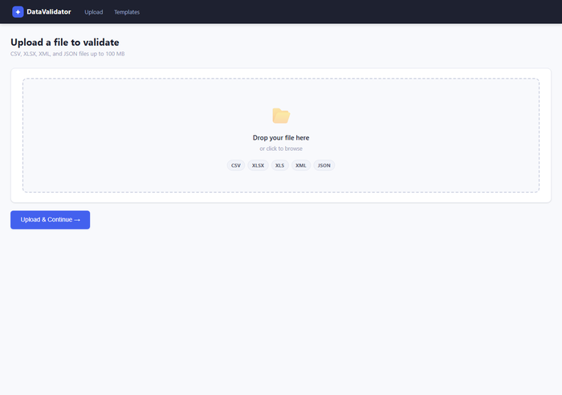
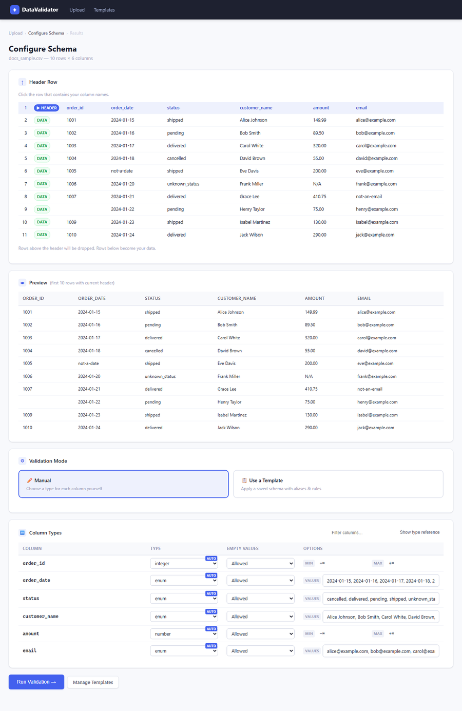
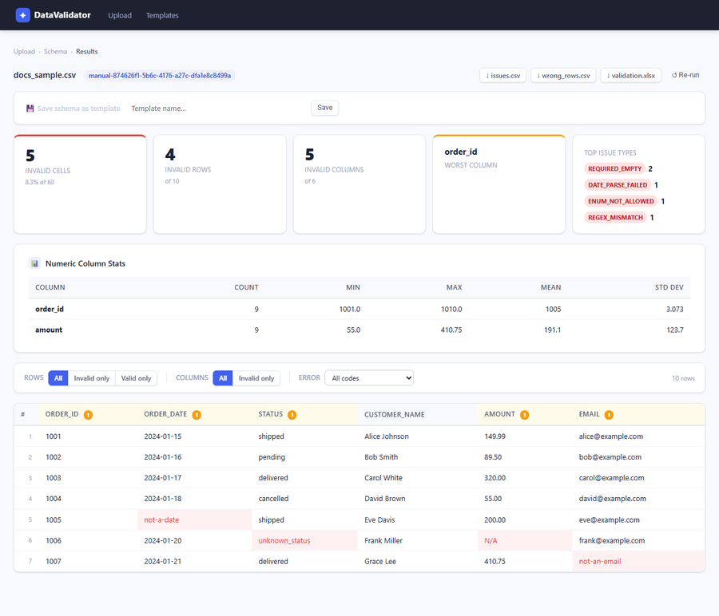
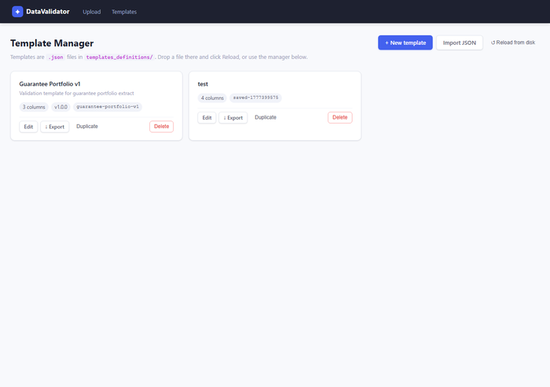
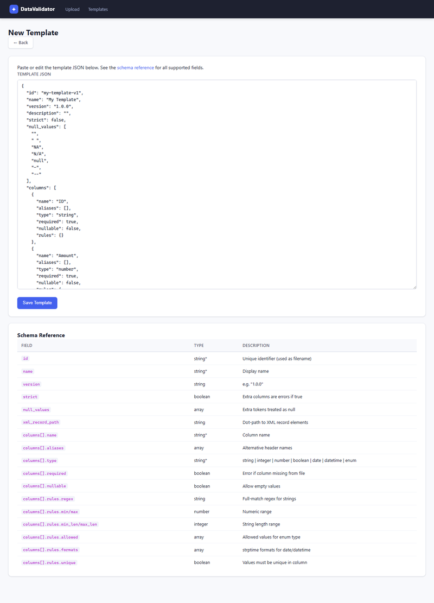

# DataValidator

A local web application for validating tabular data files (CSV, Excel, JSON, XML) against configurable schemas.

Upload a file, configure column types and rules, run validation, and download annotated results.

---

## Screenshots

### Upload

Drop or browse for a CSV, XLSX, XLS, XML, or JSON file (up to 100 MB) to begin.



---

### Schema configuration

Column types are inferred automatically and pre-selected. Switch between Manual mode (per-column type, empty-value policy, and rules) and Template mode (apply a saved schema). Use the header-row picker to re-ingest the file with a different header row.



---

### Results

Summary cards show invalid cell / row / column counts and the top error codes. The filterable table highlights invalid cells in red — hover a cell for the error message. Download results as `issues.csv`, `wrong_rows.csv`, or an annotated `validation.xlsx`.



---

### Template manager

Create, edit, export, duplicate, and delete reusable validation schemas. Templates are plain JSON files stored in `templates_definitions/` and can be imported/exported for sharing.



---

### Template editor

A JSON editor with a built-in schema reference. The template is validated against the meta-schema on save and field-level errors are shown inline.



---

## ⚠️ Security Notice

**This software is not production-ready and must not be deployed on a public-facing server without significant hardening.**

Known limitations that are acceptable for local / internal development use but must be addressed before any public deployment:

- **No authentication or authorisation.** Anyone who can reach the server can upload files, read results, and manage templates.
- **No rate limiting.** The upload endpoint and validation runner accept unlimited requests.
- **Uploaded files are stored on the local filesystem** under `data/uploads/` with no automatic expiry or cleanup.
- **The `SECRET_KEY` defaults to a hard-coded development value.** Set the `SECRET_KEY` environment variable to a long random string before running in any shared environment.
- **File-size validation relies on Flask's `MAX_CONTENT_LENGTH`.** This prevents oversized uploads at the HTTP layer but does not prevent a malicious file from consuming excessive CPU/memory during parsing.
- **XML parsing uses Python's `xml.etree.ElementTree`**, which is [not safe against maliciously crafted XML](https://docs.python.org/3/library/xml.html#xml-vulnerabilities) (billion-laughs / XXE attacks).
- **Template IDs are sanitised** before being used as filenames, but the template JSON editor accepts free-form input — validate and review any imported templates from untrusted sources.

---

## AI Assistance Disclosure

The **Python backend** (ingestion, validation engine, schema matching, type inference, storage, exports) was written and reviewed by me and represents the primary focus of this project.

The **HTML templates, CSS, and front-end JavaScript** were produced with the assistance of an AI coding assistant (Claude by Anthropic). They have been reviewed for correctness but may not meet the same standard of code quality as the Python backend, and should be audited before use in any context where front-end security matters.

The **documentation** (this README, module docstrings, and inline code comments) was also generated with AI assistance and subsequently reviewed for factual correctness against the source code.

---

## Features

- **Multi-format ingestion** — CSV (auto-encoding + delimiter detection), XLSX/XLS (multi-sheet), JSON (array or wrapped-object), XML (auto-detected or user-specified record path)
- **Header-row picker** — visually select which row contains column names
- **Auto type inference** — column types are pre-selected based on the actual data (integer, number, boolean, date, datetime, enum, string)
- **Manual schema configuration** — choose a type and empty-value policy for each column, with type-specific options:
  - `string` — optional regex pattern
  - `integer` / `number` — optional min / max bounds
  - `date` / `datetime` — format picker with common presets + custom entry
  - `enum` — comma-separated list of allowed values
- **Template system** — save a schema as a named template, reuse it across uploads, import/export as JSON
- **Validation engine** — type checking, null/required rules, range rules, regex, enum allow-lists, blocklists, unique constraints, composite unique-together constraints
- **Results view** — infinite-scroll table, filter by valid/invalid rows and columns, filter by error code, per-column invalid-cell counts
- **Downloads** — issues.csv, wrong_rows.csv, validation.xlsx (annotated workbook with red-highlighted cells and error comments)

---

## Requirements

- Python 3.10+
- See `requirements.txt` for package dependencies

Key dependencies:
| Package | Purpose |
|---------|---------|
| Flask | Web framework |
| pandas | DataFrame ingestion and manipulation |
| pyarrow | Parquet serialisation (raw data storage) |
| openpyxl | Excel read/write |
| jsonschema | Template JSON schema validation |

---

## Installation

```bash
# 1. Clone or download the repository
cd EntryValidation

# 2. Create and activate a virtual environment
python -m venv .venv
# Windows
.venv\Scripts\activate
# macOS / Linux
source .venv/bin/activate

# 3. Install dependencies
pip install -r requirements.txt

# 4. Run the development server
python app.py
```

The application will be available at `http://localhost:5000`.

---

## Configuration

All settings are read from environment variables with sensible development defaults:

| Variable | Default | Description |
|----------|---------|-------------|
| `SECRET_KEY` | `dev-secret-key-change-in-prod` | Flask session secret — **change in production** |
| `MAX_UPLOAD_BYTES` | `104857600` (100 MB) | Maximum upload file size |

---

## Project Structure

```
EntryValidation/
├── app.py                      # Flask routes
├── config.py                   # Application settings
├── requirements.txt
├── core/
│   ├── ingestion.py            # CSV / XLSX / JSON / XML ingestion
│   ├── type_inference.py       # Auto-detect column types from data
│   ├── schema_match.py         # Template matching and schema building
│   ├── validation.py           # Type parsers + rules engine
│   ├── stats.py                # Post-processing helpers for results view
│   ├── export.py               # CSV / XLSX export generators
│   ├── storage.py              # Filesystem read/write helpers
│   ├── templates_repo.py       # In-memory template cache + persistence
│   ├── template_validator.py   # JSON Schema validation for templates
│   ├── template_schema.json    # Meta-schema describing a valid template
│   └── utils.py                # Shared utilities (slugify, null check, …)
├── templates/                  # Jinja2 HTML templates
├── static/                     # CSS and JavaScript
│   ├── styles.css
│   └── results.js              # Infinite-scroll logic for the results table
├── templates_definitions/      # Saved template JSON files
└── data/
    ├── uploads/                # Uploaded source files (per dataset UUID)
    └── derived/                # Parquet + JSON artefacts (per dataset UUID)
```

---

## Template Format

Templates are JSON files stored in `templates_definitions/`. Example:

```json
{
  "id": "orders-v1",
  "name": "Orders Template",
  "strict": false,
  "null_values": ["N/A", "TBD"],
  "columns": [
    {
      "name": "order_id",
      "aliases": ["Order ID", "OrderID"],
      "type": "integer",
      "required": true,
      "nullable": false,
      "rules": { "min": 1 }
    },
    {
      "name": "order_date",
      "type": "date",
      "required": true,
      "nullable": false,
      "rules": { "formats": ["%Y-%m-%d"] }
    },
    {
      "name": "status",
      "type": "enum",
      "required": false,
      "nullable": true,
      "rules": { "allowed": ["pending", "shipped", "delivered", "cancelled"] }
    }
  ]
}
```

Templates can be created in the UI, exported as JSON, edited externally, and re-imported.

---

## Developer Documentation

See **[DEVELOPER.md](DEVELOPER.md)** for the full developer reference.

### Request lifecycle

Every upload follows the same sequence:

```
POST /upload
  └─ ingest_*(filepath)          → (df: all-string DataFrame, meta: dict)
  └─ storage.save_raw()          → data/derived/<id>/raw.parquet
  └─ storage.save_meta()         → data/derived/<id>/meta.json
  └─ redirect → GET /schema/<id>

GET /schema/<id>
  └─ storage.load_raw()
  └─ type_inference.infer_all()  → {col: {type, formats?, allowed?}}
  └─ render schema.html

POST /schema/<id>
  └─ schema_match.build_manual_schema()   (manual mode)
  │    or build_resolved_schema()         (template mode)
  └─ storage.save_schema()       → data/derived/<id>/schema.json
  └─ redirect → POST /validate/<id>

POST /validate/<id>
  └─ validation.run_validation() → issues dict
  └─ storage.save_issues()       → data/derived/<id>/issues.json
  └─ redirect → GET /results/<id>

GET /results/<id>                → renders table shell (no row data yet)
GET /results/<id>/rows           → JSON chunks loaded by results.js (infinite scroll)
```

---

### Data storage

Each upload is assigned a UUID (`dataset_id`). All artefacts live under that ID:

```
data/
├── uploads/<dataset_id>/
│   └── <original_filename>        ← raw uploaded file
└── derived/<dataset_id>/
    ├── meta.json                  ← file metadata (rows, cols, file type, …)
    ├── raw.parquet                ← ingested data as all-string Parquet
    ├── schema.json                ← resolved validation schema
    └── issues.json                ← validation results
```

Nothing is shared between datasets. There is no database — all state is in these four files.

---

### Key data structures

#### `schema.json`

```json
{
  "id": "manual-<dataset_id>",
  "name": "Manual Schema",
  "strict": false,
  "null_values": [],
  "dataset_id": "<dataset_id>",
  "columns": {
    "order_id": {
      "name": "order_id",
      "file_column": "order_id",
      "template_column": null,
      "type": "integer",
      "required": true,
      "nullable": false,
      "unvalidated": false,
      "rules": { "min": 1 }
    }
  }
}
```

`columns` is a dict keyed by **file column name**. `file_column` and `template_column` track the mapping when a template is used. `unvalidated: true` marks columns present in the file but not in the schema — they appear in the results view but no rules are checked.

#### `issues.json`

```json
{
  "dataset_id": "...",
  "schema_id": "...",
  "run_at": "2024-01-15T10:30:00+00:00",
  "dataset_issues": [
    { "code": "MISSING_COLUMN", "column": "order_id", "message": "..." }
  ],
  "cell_issues": [
    { "row": 4, "column": "price", "code": "TYPE_MISMATCH", "message": "..." }
  ],
  "column_summary": {
    "price": { "invalid_count": 3, "total": 100, "numeric_stats": { ... } }
  },
  "stats": {
    "rows": 100, "columns": 5, "total_cells": 500,
    "invalid_cells": 3, "invalid_rows": 3, "invalid_columns": 1,
    "worst_column": "price",
    "top_issue_codes": [["TYPE_MISMATCH", 3]]
  }
}
```

`row` in `cell_issues` is the **0-based DataFrame index** (not the 1-based display number shown in the UI).

---

### Validation engine

`validation.run_validation(df, schema)` works in four passes:

1. **Dataset-level pre-checks** — missing required columns, extra columns (strict mode).
2. **Per-column cell loop** — for each column, for each row:
   - Null check (`required` / `nullable`)
   - Type parse (`integer`, `number`, `boolean`, `date`, `datetime`, `enum`)
   - Rule checks (`min`, `max`, `regex`, `not_in`, `unique`, etc.)
3. **Dataset rules** — `unique_together` composite key checks across the full DataFrame.
4. **Recount** — `invalid_count` in `column_summary` is recomputed from the final `cell_issues` list so dataset-rule additions are included.

All issue codes are string constants defined at the top of `validation.py` (e.g. `TYPE_MISMATCH`, `DATE_PARSE_FAILED`, `ENUM_NOT_ALLOWED`).

---

### Type inference

`type_inference.infer_all(df)` samples up to 500 values per column and applies a match-rate threshold of 95%. Detection order (first match wins):

```
integer → number → datetime → date → boolean → enum → string
```

Integer is checked before boolean so `0`/`1` columns are classified as integers. Datetime is checked before date to avoid partial format matches. The result pre-populates the schema UI but is never persisted — the user can override any inferred type before running validation.

---

### Adding a new validation rule

1. Add a rule key to `core/template_schema.json` under `properties.columns.items.properties.rules`.
2. Implement the check in `_apply_rules()` in `core/validation.py`.
3. Add a corresponding issue code constant at the top of `validation.py`.
4. Optionally expose a UI field in `templates/schema.html` and inject the value in the `schema_submit` route in `app.py`.

---

### Adding a new file type

1. Add the extension to `ALLOWED_EXTENSIONS` in `config.py`.
2. Write an `ingest_*(filepath) → (df, meta)` function in `core/ingestion.py`. The function must:
   - Return an **all-string DataFrame** (use `fillna("").astype(str)` and run `_clean_string_df()`).
   - Include `rows`, `cols`, and `columns` in `meta`.
3. Add an `elif ext == "..."` branch in the `upload_file` route in `app.py`.

---

### Front-end / back-end boundary

The results page is split into two parts:

- **`GET /results/<id>`** — renders the page shell: stats cards, toolbar, and an empty `<tbody>`. No row data is embedded in the HTML.
- **`GET /results/<id>/rows`** — JSON endpoint consumed by `static/results.js`. Accepts `offset`, `limit`, `mode`, `cols`, and `error_code` query parameters. Returns batches of 100 rows. The JS uses an `IntersectionObserver` on a sentinel element at the bottom of the table to trigger loads automatically.

The config object bridging Python → JS is injected as a `<script>` block at the bottom of `results.html`:

```js
window.__resultsConfig = {
  rowsUrl: "/results/<id>/rows",
  params:  { mode: "all", cols: "all", error_code: "" },
  total:   1500
};
```

---

### Running the tests

```bash
pytest tests/
```

Tests live in the `tests/` directory. The core validation and ingestion modules are tested independently of Flask.
